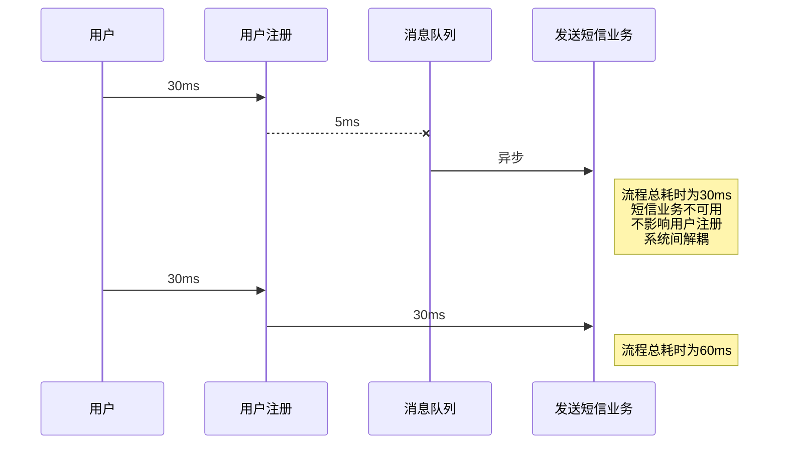
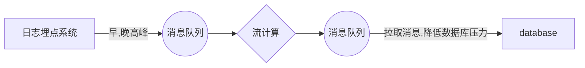
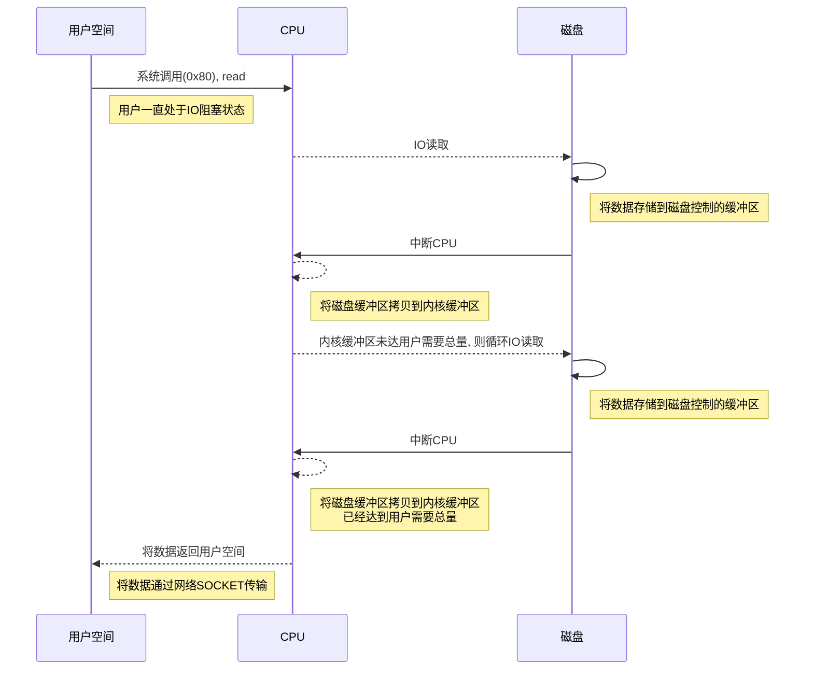
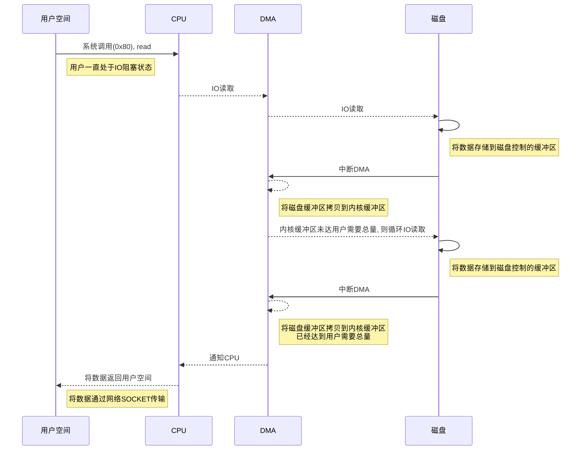
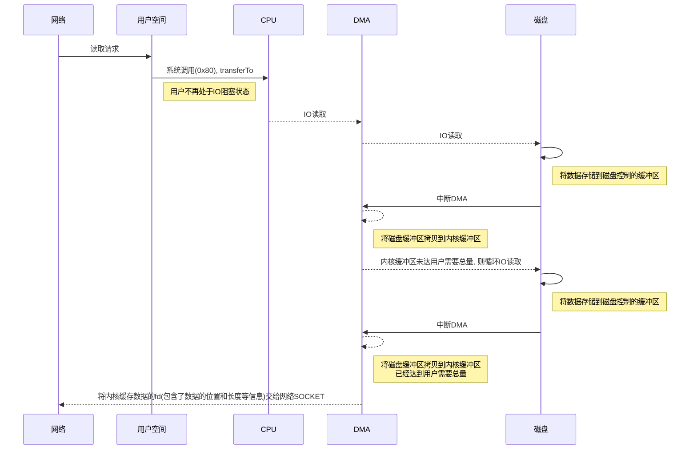

##### kafka
****
**What**
- 流处理平台
- scala和java编写
- 高吞吐量的分布式发布订阅消息系统(Message Queue)
- 系统间解耦, 异步通讯, 削峰填谷
- 实时在线流处理(streamimg插件, 应用端), ps: 服务端流处理: strom, spark, flink)

**对于系统业务间的异步解耦**

**对于日志埋点系统的削峰**

**消息队列工作模式**
- 至多一次
> 消息生产者将数据写入消息系统, 然后由消费者负责去拉取消息服务器中的消息. 一个消息一旦被确认消费之后, 由消息服务器主动删除队列中的数据. 这种消费方式只允许被一个消费者消费, 并且消息队列中的数据不允许被重复消费.
- 没有限制(kafka属于这种)
> 消息生产者将数据写入消息系统, 该消息可以被多个消费者同时消费, 并且同一个消费者可以多次消费消息服务器中的同一个记录. (维护每个消费者的消费队列偏移量(linux的fd, 因此每个消费者是相对独立的)消息服务器一般可以长时间存储海量消息. 

**kafka集群**
- kafka集群以topic(主题, 逻辑队列)形式负责分类集群中的record(消息), 每一个record属于一个topic. 一个topic通常有多个订阅者(消费者).
- 每个topic底层都会对应一组partition(分区,  实际队列)的日志用于持久化topic中的record
- partition一般存在自己的replica(冗余备份, 通过副本因子配置). 以三节点, 一个topic, 一组partition, 分区数=3(partition0, partition1, partition2), 分区副本因子=3为例, 单节点宕机, 如partition0数据丢失可以从$partition0^{'}$或$partition0^{''}$恢复
- topic的每一个日志的分区都一定会有1个broker(消息服务端实例)担当该分区的leader, 其他的broker担当该分区的follower
- leader负责分区数据的读写操作, follower负责同步leader分区的数据至follower所在节点的分区中。这样如果分区的leader宕机, 其他follower会通过zookeeper选取出新的leader继续负责该分区数据的读写
- kafka集群的中leader的监控和topic的部分元数据是存储在zookeeper中.

**partition(分区)**
- 磁盘顺序写(按时间顺序写入), 速度远高于rdb随机读写
> 单个partition是FIFO, 按时间顺序排序写入, old时间的record在文件开头; 但是分区之间的写入顺序是无序的(无法确定哪个分区的第0位置record的时间戳总是最小)
> 所以要想topic全局FIFO, 那么仅指定一个分区才能实现
> 牺牲topic整体有序性, 达到单个topic的海量存储的设计目的(主要为大数据服务). 大量record/较大分区数, 使得分区文件小, 写入处理速度快(并发请求高)
- 分区策略
> round-robin, 分区数=2为例: 第1条去0分区, 第2条去1分区, 第3条去0分区, 仅仅达到负载均衡
> hash, 每条record根据key的hash值对分区数取模(去哪个分区= hash(record的key)  % 分区数 ), 决定该record存放哪个分区, 分治同时确保同一条record在同一个partition
- offset (偏移量)
> 每组日志分区是一个有序的不可变的的日志序列(FIFO, 先进先出队列), 分区中的每一个Record都被分配了唯一的序列编号称为是offset
> kafka会持久化所有发布到topic中的record, 默认168小时(7天, 根据实际消费速度配置, 避免未被消费就被kafka清除)
> log.retention.hours=168
> kafka定期的检查日志文件，将过期的数据从log中移除，由于kafka使用硬盘存储日志文件，kafka不会长时间在内存中缓存日志文件
- 分区目的
> 允许日志文件扩展到超出单个服务器所能容纳的大小. 每个单独的分区都必须适合托管它的服务器, 但是一个topic可能有很多分区, 因此它可以处理任意数量的数据。
> 每个服务器充当其某些分区的leader, 也可能充当其他分区的follwer, 因此群集中的负载得到了很好的平衡(不同分区的leader可能不同, 降低所有分区通过一个leader来管理而导致单台服务器性能问题的影响)

**consumer(消费者)**
- 在消费者消费topic中数据的时候, 每个消费者会维护本次消费对应分区的offset(偏移量), 消费者会在消费完一个批次的数据之后, 会将本次消费的offset(一般提交的是下一次需要读取的位置)提交给kafka集群
- 对于每个消费者而言可以随意的控制改消费者的offset. 
- 在kafka中, 消费者可以从一个topic分区中的任意位置读取队列数据
- 由于每个消费者控制了自己的消费的偏移量, 多个消费者之间彼此相互独立
- 每个Consumer Group可以理解为一个“逻辑的订阅者”,  每个Consumer Group均由许多Consumer实例组成, 以实现可伸缩性和容错能力, 这无非就是发布-订阅模型, 其中订阅者是消费者的集群而不是单个进程. 
> 消费者使用Consumer Group名称标记自己(一个消费组会含有一至多个消费者实例, 取决于几个kafka客户端消费该topic), 发布到topic的每条记录都会传递到每个订阅Consumer Group中的一个消费者实例(避免重复消费, 每个消费组属于不同业务线)
> 如果一个topic有4个分区, 有ConsumerGroupA(2个consumer实例) 和 ConsumerGroupB(4个consumer实例). 
> 那么在ConsumerGroupA每个consumer实例均匀分配2个分区; 在ConsumerGroupB每个consumer实例均匀分配1个分区. 
> 且topic中每条record将广播到所有Consumer Group进程(ConsumerGroupA 和 ConsumerGroupB). 
> 如果此时ConsumerGroupB某个consumer实例宕机, 则没有对应consumer的分区会分配到剩下consumer中去消费. 如果宕机实例恢复正常, 则含有2两个分区的实例会将一个分区移交回恢复实例; 如果此时, ConsumerGroupB又添加了一个consumer实例(分区=4 小于 consumer实例数5), 则新增的consumer不会被分配到分区去消费(但可以作为consumer备机)
> 所以分区数决定了kafka并发消费的上限, 分区数越大且消费组的consumer实例同步增加, 则并发越高

**高性能-写入**
- Kafka的特性之一就是高吞吐率，但是Kafka的消息是保存或缓存在磁盘上的，一般在磁盘上读写数据性能是不高的，但kafka可以轻松支持每秒百万级的写入请求，主要是采用了顺序写入和MMFile(memory mapped files, 内存映射文件, 简称mmap)
- 顺序写
> 因硬盘寻址相对读写耗时, 每次读写都会寻址->写入, 随机I/O(RDB很多都是随机I/O)要比顺序I/O慢很多. 为了提高读写硬盘的速度, kafka就是使用顺序I/O. 这样省去了大量的内存开销(减少jvm垃圾回收)以及节省了IO寻址的时间. 
> 但是单纯的使用顺序写入, kafka的写入性能也不可能和内存(寻址读写速度远远高于硬盘)进行对比, 因此Kafka的数据并不是实时的写入硬盘中
- MMAP
> kafka充分利用了操作系统分页存储来利用内存提高I/O效率. mmap称为内存映射文件, 在64位操作系统中一般可以表示20G的数据文件
> 它的工作原理是直接利用操作系统的pagecache实现磁盘文件到物理内存的直接映射. 完成MMP映射后, 用户对内存的所有操作会被操作系统自动的刷新到磁盘上，极大地降低了IO使用率. (用户将不直接把数据写入磁盘, 而是写入内存(pagecache)中, pagecache数据会被体统定时(间隔由系统参数配置)刷写进磁盘)
> 直接写入硬盘, 速度慢, 但安全; 使用pagecache, 速度快, 但操作系统宕机(断电)会丢失数据(应用(用户态)挂掉不影响, pagecache是内核态, 数据依然会被操作系统刷入硬盘)

**高性能-读取**
- kafka服务器在响应客户端读取时, 使用ZeroCopy技术, 直接将需要读取的数据从内核空间的磁盘中传递输出, 而无需将数据读取并拷贝到用户空间, 再进行传输
> ZeroCopy, 调用操作系统的transferTo()方法后数据被DMA从文件复制到了内核的一个缓冲区中
> 并将一个描述符fd(包含了数据的位置和长度等信息)追加到socket关联的缓冲区中. DMA直接将内核中的缓冲区中的数据传输给协议引擎
> 减少用户态到内核态的切换, 以及应用0x80中断导致cpu时间片段的占用

- **传统IO操作**
1. 用户进程调用read等系统调用向操作系统发出IO请求, 请求读取数据到自己的内存缓冲区中. 自己进入阻塞状态
2. 操作系统收到请求后, 进一步将IO请求发送磁盘
3. 磁盘驱动器收到内核的IO请求, 把数据从磁盘读取到驱动器的缓冲中. 此时不占用CPU. 当驱动器的缓冲区被读满后, 向内核发起中断信号告知自己缓冲区已满
4. 内核收到中断, 使用CPU时间将磁盘驱动器的缓存中的数据拷贝到内核缓冲区中
5. 如果内核缓冲区的数据少于用户申请的读的数据, 重复步骤3跟步骤4, 直到内核缓冲区的数据足够多为止
6. 将数据从内核缓冲区拷贝到用户缓冲区, 同时从系统调用中返回. 完成任务

> 问题:
> 未拷贝完成时, 磁盘会频繁中断CPU

- **引入DMA(协处理器)后**
1. 用户进程调用read等系统调用向操作系统发出IO请求，请求读取数据到自己的内存缓冲区中。自己进入阻塞状态。
2. 操作系统收到请求后，进一步将IO请求发送DMA。然后让CPU干别的活去。
3. DMA进一步将IO请求发送给磁盘。
4. 磁盘驱动器收到DMA的IO请求，把数据从磁盘读取到驱动器的缓冲中。当驱动器的缓冲区被读满后，向DMA发起中断信号告知自己缓冲区已满。
5. DMA收到磁盘驱动器的信号，将磁盘驱动器的缓存中的数据拷贝到内核缓冲区中。此时不占用CPU。这个时候只要内核缓冲区的数据少于用户申请的读的数据，内核就会一直重复步骤3跟步骤4，直到内核缓冲区的数据足够多为止。
6. 当DMA读取了足够多的数据，就会发送中断信号给CPU。
7. CPU收到DMA的信号，知道数据已经准备好，于是将数据从内核拷贝到用户空间，系统调用返回。

> 解决问题: (节约CPU资源)
> 解决未拷贝完成时, 磁盘会频繁中断CPU, 由DMA来完成磁盘到内核缓冲区的拷贝
> 跟IO中断模式相比, DMA模式下, DMA就是CPU的一个代理, 它负责了一部分的拷贝工作, 从而减轻了CPU的负担(可以理解为CPU金贵, 换了个廉价的DMA来被磁盘胖揍(中断))
> 存在问题:
> 依然存在数据从内核态拷贝到用户态

- **zero copy**
1. 文件在磁盘中数据被copy到内核缓冲区
2. 从内核缓冲区copy到内核与socket相关的缓冲区
3. 数据从socket缓冲区copy到相关协议引擎发送出去

> 解决问题: 
> 数据不再从内核态拷贝到用户态, 再交给网络I/O, 而是直接在内核态进行网络传输
> 通过 transferTo 将内核缓存 
