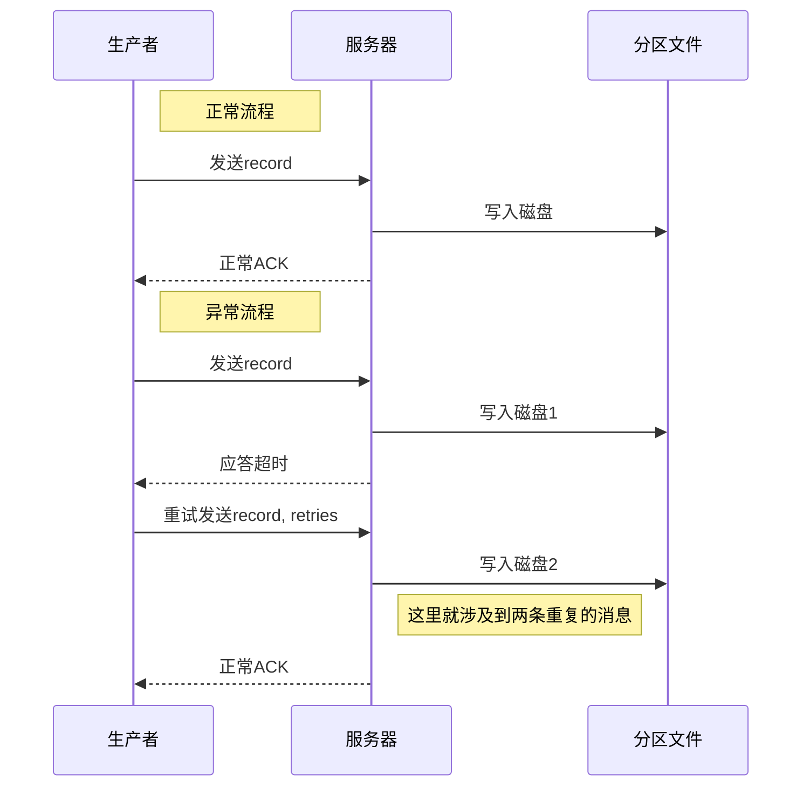

**kafka的ack&retries**

```mermaid
sequenceDiagram
Note right of 生产者: 正常流程
生产者 ->> 服务器: 发送record
服务器 ->> 分区文件: 写入磁盘
服务器 -->> 生产者 : 正常ACK
Note right of 生产者: 异常流程
生产者 ->> 服务器: 发送record
服务器 ->> 分区文件: 写入磁盘1
服务器 -->> 生产者 : 应答超时
生产者 ->> 服务器: 重试发送record, retries
服务器 ->> 分区文件: 写入磁盘2
Note right of 服务器: 这里就涉及到两条重复的消息
服务器 -->> 生产者 : 正常ACK
```