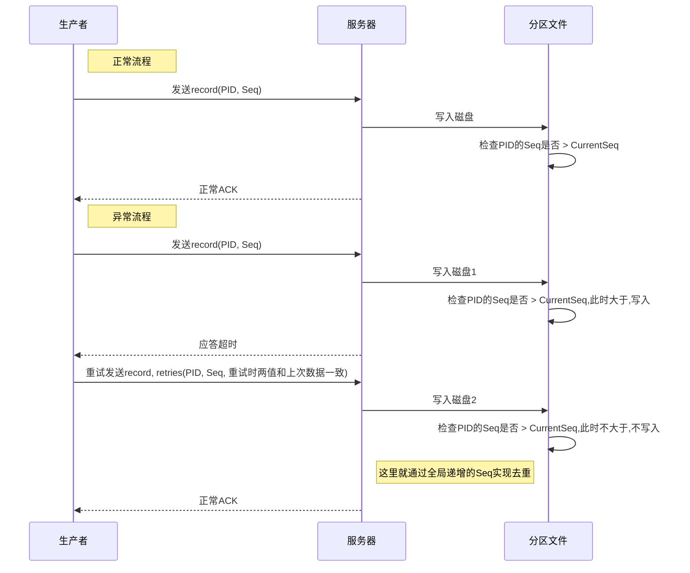

**kafka的idempotence**

```mermaid
sequenceDiagram
Note right of 生产者: 正常流程
生产者 ->> 服务器: 发送record(PID, Seq)
服务器 ->> 分区文件: 写入磁盘
分区文件 ->> 分区文件: 检查PID的Seq是否 > CurrentSeq
服务器 -->> 生产者 : 正常ACK
Note right of 生产者: 异常流程
生产者 ->> 服务器: 发送record(PID, Seq)
服务器 ->> 分区文件: 写入磁盘1
分区文件 ->> 分区文件: 检查PID的Seq是否 > CurrentSeq,此时大于,写入
服务器 -->> 生产者 : 应答超时
生产者 ->> 服务器: 重试发送record, retries(PID, Seq, 重试时两值和上次数据一致)
服务器 ->> 分区文件: 写入磁盘2
分区文件 ->> 分区文件: 检查PID的Seq是否 > CurrentSeq,此时不大于,不写入
Note right of 服务器: 这里就通过全局递增的Seq实现去重
服务器 -->> 生产者 : 正常ACK
```